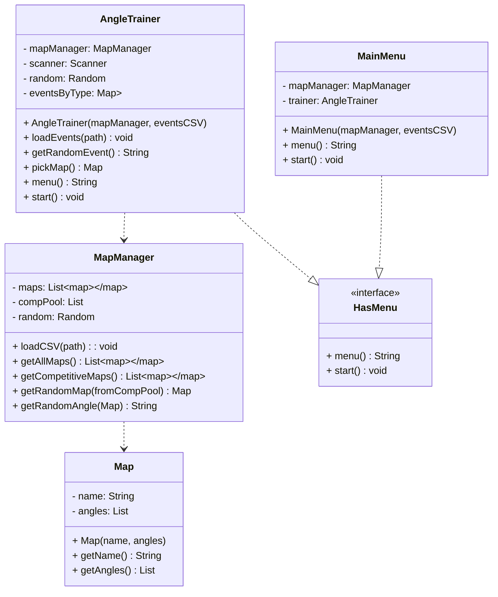

# CS121_Valorant-Callout-Trainer


## HasMenu
HasMenu Interface
```
Define an interface named HasMenu

Define menu method:
    returns a string showing options to the user

Define start method:
    runs the menu system
```

## Map
Map()
```
Define a class named Map

Fields:
    name: String
    angles: List of String

Constructor(name, angles):'
    set this.name to name
    set this.angles to angles

getName():
    return name

getAngles();
    return angles
```

## MapManager
MapManager()
```
Define a class named MapManager

Fields:
    maps: List of Map
    compPool: List of String (map names in competitive pool)
    random: Random

loadCSV(path):
    open CSV file at path
    for each line in CSV:
        parse map name and angles
        create Map object with name and angles
        add Map object to maps

getAllMaps():
    return maps

getCompetitiveMaps():
    create list for competitive maps
    for each map in maps:
        if map.name is in compPool:
            add map to competitive list
    return competitive list

getRandomMap(fromCompPool):
    if fromCompPool is true:
        listToUse = getCompetitiveMaps()
    else:
        listToUse = getAllMaps()
    select random map from listToUse
    return selected map

getRandomAngle(map):
    select random angle from map.getAngles()
    return slected angle
```

## AngleTrainer
AngleTrainer()
```
Define a class named AngleTrainer that implements HasMenu

Fields:
    mapManager: MapManager
    scanner: Scanner
    random: Random
    eventsByType: Map<String, List<String>>

Constructor(mapManager, eventsCSV):
    set this.mapManager to mapManager
    initialize scanner
    initialize ranodm
    call loadEvents(eventsCSV)

loadEvents(path):
    open CSV file at path
    for each line in CSV:
        parse event type and event name
        add event to eventsByType[eventType]

getRandomEvent():
    select random category from eventsByType keys
    select random event from that category
    return selected event

pickMap():
    show user a list of maps with numbers
    ask user to pick a map number
    return the selected map object

menu():
    display:
        "0) Exit Training"
        "1) Train on competitive pool (random map)"
        "2) Train on all maps (random map)"
        "3) Pick map manually"
    return user's choice

start():
    set keepTraining to true
    while keepTraining is true:
        chocie = call menu()
        if choice == 0:
            keepTraining = false
        elif choice == 1:
            currentMap = getRanodmMap(fromCompPool = true)
        elif choice == 2:
            currentMap = getRandomMap(fromCompPool = false)
        elif choice - 3:
            currentMap = pickMap()
        else:
            print "Invalid option"

    set keepScenario to true
    while keepScenario is true:
        angle = mapManager.getRandomAngle(currentMap)
        enemyCount = random number between 1 and 5
        event = getRandomEvent()
        print "You see " + enemyCount + " enemies at " + angle + " on " + currentMap + " and " + event + "."
        print "Speak your callout and aloud and press Enter when done..."
        start timer
        wait for user to press Enter
        stop timer
        print "Communication time: " + elapsed seconds + " seconds."
        print "Example callout: " + enemyCount + angle + event
        ask user: "Press Enter to repeat with same settings or type M to return to menu"
        if user input is "M" or "m":
            set keepScenario to false
```

## MainMenu
MainMenu()
```
Define a class named MainMenu that implemetns HasMenu

Fields:
    mapManager: MapManager
    trainer: AngleTrainer

Constructor(mapManager, eventsCSV):
    set this.mapManager to mapManager
    initialize trainer = new AngleTrainer(mapManager, eventsCSV)

menu():
    display:
        "--- Main Menu ---"
        "0) Exit"
        "1) Start Training"
    return user's choice

start():
    set keepGoing to true
    while keepGoing is true:
        choice = call menu()
        if choice == 0:
            set keepGoing to false
        elif choice == 1:
            trainer.start()
        else:
            print "Invalid option"
```
