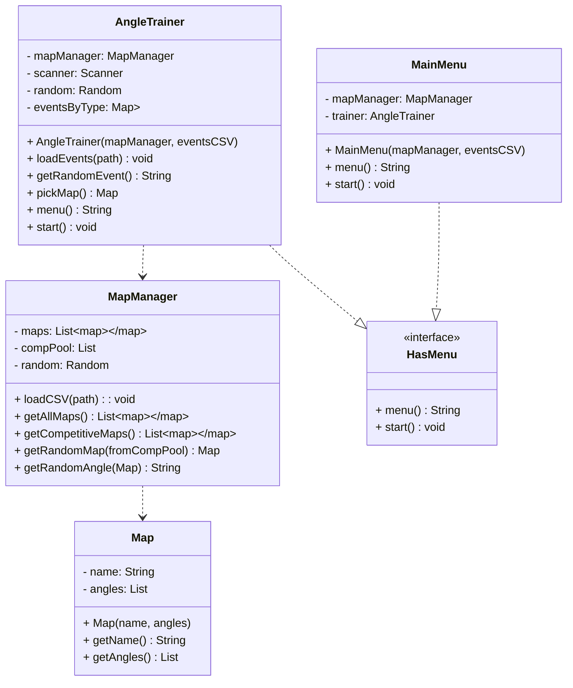

# CS121_Valorant-Callout-Trainer

```mermaid
classDiagram
class HasMenu {
    <<interface>>
    + menu() String
    + start() void
}

class Map {
    - name: String
    - angles: List<String>
    + Map(name, angles)
    + getName() String
    + getAngles() List<String>
}

class MapManager {
    - maps: List<Map>
    - compPool: List<String>
    - random: Random
    + loadCSV(path): void
    + getAllMaps() List<Map>
    + getCompetitiveMaps() List<Map>
    + getRandomMap(fromCompPool) Map
    + getRandomAngle(Map) String
}

class AngleTrainer {
    - mapManager: MapManager
    - scanner: Scanner
    - random: Random
    - eventsByType: Map<String, List<String>>
    + AngleTrainer(mapManager, eventsCSV)
    + loadEvents(path) void
    + getRandomEvent() String
    + pickMap() Map
    + menu() String
    + start() void
}

class MainMenu {
    - mapManager: MapManager
    - trainer: AngleTrainer
    + MainMenu(mapManager, eventsCSV)
    + menu() String
    + start() void
}

MapManager ..> Map
AngleTrainer ..> MapManager
AngleTrainer ..|> HasMenu
MainMenu ..|> HasMenu
```
